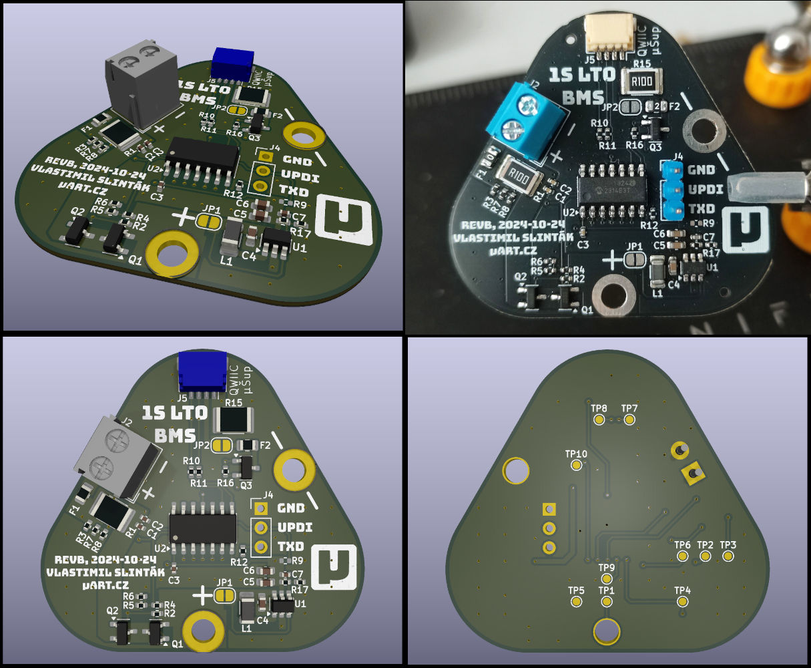
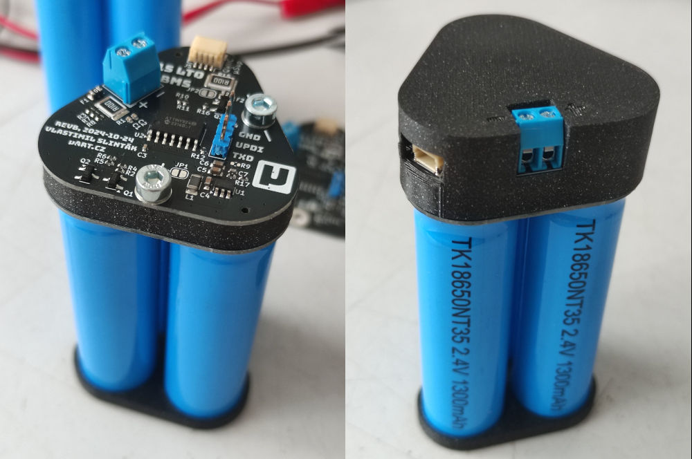

# LTO Battery Management System (BMS)

This project is an open-source Battery Management System (BMS) designed for a 1S
Lithium Titanate (LTO) battery pack. It is intended for low-power applications,
specifically the [Meshtastic project](https://meshtastic.org), where expected
discharge currents are in the tens of milliamps, and charging is usually
handled by a solar panel with MPPT, reaching up to several hundred milliamps.

More details about the project can be found here:
[LTO BMS Development Notes](https://uart.cz/en/2557/lto-bms-development-notes/).

## Understanding LTO Batteries

LTO batteries, or Lithium Titanium Oxide batteries, have one enormous
advantage — they can be charged and discharged at sub-zero temperatures. This
makes them ideal for applications such as weather stations, Meshtastic nodes,
and other outdoor electronics.

LTO batteries have lower energy density than other types, so less Ah fits into
the same package. They have a lower operating voltage, a minimum of 1.5 V
(some sources and manufacturers report 1.7 V), and a maximum of 2.8 V
(again, you may read 2.9 V elsewhere). They are chemically very stable, posing
no risks of swelling, fires, or explosions like Li-Ion or Li-Pol cells. Some
manufacturers claim that LTO can be discharged to 0 V and overcharged above 3 V
without exploding or getting damaged.

However, for the average hobbyist, usage can be a bit more complicated because
LTO batteries have a lower voltage than standard Li-Ion or Li-Pol batteries,
and there is no available electronic protection for single-cell LTO. That’s why
I set out to design my own solution that, in addition to OVLO/UVLO/OC, also
continuously measures the cell parameters and communicates them over I2C.




## Features

- Supports 1S LTO battery configuration.
- Under-voltage (UVLO) protection.
- Over-voltage (OVLO) protection.
- Over-current (OCLO) protection.
- Metrics available over I2C (the interface immitates INA260 IC).
- Designed for low-power applications, up to 1 A charging and discharging.
- Uses ATTiny824 with an integrated ADC, I2C, and temperature sensor.

## Hardware Requirements

- Custom PCB designed for LTO BMS (designed by the author).
- 1S LTO battery pack.
- USB-UART converter for programming.

## Software Requirements

- GCC toolchain for AVR (AVR-GCC, [pymcuprog](https://github.com/microchip-pic-avr-tools/pymcuprog), etc.)
- Python 3 (for EEPROM configuration and logging tools)
- Docker (optional, for storing metrics to InfluxDB and Grafana during development and long-term testing)

## Compilation and Flashing

Ensure you have the necessary tools installed. The code was developed under
Ubuntu OS, so the following commands should work on any Debian-based system.

```
sudo apt update
sudo apt install -y gcc-avr python3-pip

# Installing Python packages in a virtual environment is recommended.
pip3 install -r requirements.txt
```

To build the firmware, run:

```
make
# Or with enabled debug logging
make DEBUG=1
```

The microcontroller can be programmed using `pymcuprog` with a USB-UART
converter. The RX and TX lines of the converter should be connected via a 1kΩ
resistor, with the RX line then connected to the UPDI on the BMS PCB. To flash
the firmware, use:

```
make fuses  # Run only once.
make flash
```

To configure EEPROM settings, use the provided Python script:

```
python eeprom.py --sn 7 --temp-offset 5
objcopy --input-target=binary --output-target=ihex --change-addresses=0x810000 eeprom.bin eeprom.hex
pymcuprog write -f eeprom.hex -t uart -d attiny824 -u [COM]
```

or by using a Makefile target:

```
make eeprom SN=7 TO=5
```

## EEPROM Configuration

The ATTiny824 has 128 B of EEPROM. The firmware uses this memory to store
configuration settings such as the serial number, voltage and current limits,
and more. For fine-tuning your BMS, you can change any parameter with the
`eeprom.py` tool:

```
$ python3 eeprom.py --help
usage: eeprom.py [-h] --sn SN [--temp-offset TEMP_OFFSET] [--ovlo-cutoff OVLO_CUTOFF] [--ovlo-release OVLO_RELEASE]
                 [--uvlo-release UVLO_RELEASE] [--uvlo-cutoff UVLO_CUTOFF] [--max-current MAX_CURRENT]
                 [--oclo-timeout OCLO_TIMEOUT] [-f FILE]

EEPROM configuration generator for LTO-BMS firmware.

options:
  -h, --help            show this help message and exit
  --sn SN               Unique serial number of the BMS.
  --temp-offset TEMP_OFFSET
                        Temperature offset for the internal sensor.
  --ovlo-cutoff OVLO_CUTOFF
                        Over-voltage cutoff. Unit: mV.
  --ovlo-release OVLO_RELEASE
                        Over-voltage release. Unit: mV.
  --uvlo-release UVLO_RELEASE
                        Under-voltage release. Unit: mV.
  --uvlo-cutoff UVLO_CUTOFF
                        Under-voltage cutoff. Unit: mV.
  --max-current MAX_CURRENT
                        Maximum allowed current. Unit: mA.
  --oclo-timeout OCLO_TIMEOUT
                        Time to hold over-current lockout. Unit: s.
  -f FILE, --file FILE  Filename to write binary data.
```

## Logging

For long-term logging and testing, you can use the BMS log to store all metrics
in InfluxDB. To do this, use the `log.py` tool. First, prepare your `.env` file
with your InfluxDB bucket, token, and URL, then run:

```
python3 log.py [COM]
```

## License

This project is open-source under the MIT License. Feel free to contribute!

## Contact

For any questions or contributions, visit [uart.cz](https://uart.cz/en) or open
an issue in the repository.
